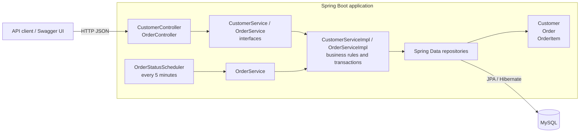

# Ecommerce API

A Spring Boot REST API for managing customers and orders. It uses Spring MVC for HTTP endpoints, Spring Data JPA/Hibernate for persistence, and MySQL as its database.

## Architecture



`Order` contains a collection of `OrderItem` records. The scheduler runs five minutes after application startup and then every five minutes, moving all pending orders to processing and refreshing their `updatedAt` timestamp.

## Application layers

- **Controllers** handle HTTP routing, request parameters, bean-validated request bodies, and HTTP response codes. They delegate application work to service interfaces.
- **DTOs** define the request and response shapes exposed by the API.
- **Services** define customer and order use cases. Their `impl` classes contain business rules, order calculations, status transitions, and transaction boundaries. Spring's `@Validated` and Jakarta Bean Validation constraints also protect service method inputs.
- **Repositories** provide persistence operations through Spring Data JPA.
- **Entities** represent the persisted customer and order data.
- **Scheduler** triggers the order-processing use case through `OrderService`; it does not access the repository directly.

Depending on service interfaces keeps controllers and the scheduler decoupled from persistence details and makes business logic independently testable.

## Background order status scheduler

`OrderStatusScheduler` is a Spring-managed background component enabled by `@EnableScheduling` in `EcommerceApplication`. It runs five minutes after the application starts and every five minutes thereafter. Each run finds orders with `PENDING` status, changes them to `PROCESSING`, updates `updatedAt`, and saves them in a transaction. Orders created while the application is running are processed on the next run, so they can remain pending for up to five minutes. Keep the application running for the scheduler to execute; restarting it resets the initial five-minute delay. `CANCELLED` and other non-pending orders are not changed by this job.

## Requirements

- JDK 17 or later
- MySQL 8
- Maven (or the included Maven wrapper)
- Docker (optional, for containerized startup)

## Configuration and startup

1. Create the database:

   ```sql
   CREATE DATABASE ecommerce;
   ```

2. Configure the MySQL URL, username, and password in `src/main/resources/application.properties` for your local environment. Do not commit credentials.
3. Start the application from the project root:

   ```powershell
   .\mvnw.cmd spring-boot:run
   ```

   Alternatively, use `mvn spring-boot:run` if Maven is installed.

The API uses the `/api` base path. OpenAPI documentation is available at [http://localhost:8080/swagger-ui/index.html](http://localhost:8080/swagger-ui/index.html), with the OpenAPI document at `/v3/api-docs`.

### Run with Docker

Build the image from the project root:

```powershell
docker build -t ecommerce-api .
```

The MySQL database must be running and the `ecommerce` database must already exist. For MySQL running on the same Windows host, set the database password in the current PowerShell session and start the container:

```powershell
$env:SPRING_DATASOURCE_PASSWORD = Read-Host "MySQL password"
docker run --rm -p 8080:8080 `
  -e SPRING_DATASOURCE_URL=jdbc:mysql://host.docker.internal:3306/ecommerce `
  -e SPRING_DATASOURCE_USERNAME=root `
  -e SPRING_DATASOURCE_PASSWORD=$env:SPRING_DATASOURCE_PASSWORD `
  ecommerce-api
```

Set the datasource environment variables to match your database. Avoid putting real passwords in source files or shell history.

## API endpoints

All request and response bodies use JSON. Order IDs are UUIDs; customer and product IDs in the order API are integers.

| Method | Endpoint | Description |
| --- | --- | --- |
| `GET` | `/api/customers` | List customers |
| `GET` | `/api/customers/{id}` | Get a customer |
| `POST` | `/api/customers` | Create a customer |
| `PUT` | `/api/customers/{id}` | Update a customer |
| `DELETE` | `/api/customers/{id}` | Delete a customer |
| `GET` | `/api/orders` | List orders; optionally filter by `status` and/or `customerId` |
| `GET` | `/api/orders/{id}` | Get an order |
| `POST` | `/api/orders` | Create an order |
| `PUT` | `/api/orders/{id}` | Update an order |
| `POST` | `/api/orders/{id}/cancel` | Cancel an order if it is pending |
| `DELETE` | `/api/orders/{id}` | Delete an order |

Order filters can be combined, for example:

```text
GET /api/orders?status=PENDING&customerId=42
```

### GET response examples

`GET /api/customers` returns a JSON array:

```json
[
  {
    "id": 42,
    "name": "Alex Morgan",
    "email": "alex@example.com"
  }
]
```

`GET /api/customers/{id}` returns one customer with the same shape:

```json
{
  "id": 42,
  "name": "Alex Morgan",
  "email": "alex@example.com"
}
```

`GET /api/orders` returns a JSON array. The same order object is returned by `GET /api/orders/{id}`; optional filters do not change the response shape:

```json
[
  {
    "id": "7bb8a0c5-83a5-4fd5-8c3a-547b8337e4d2",
    "customerId": 42,
    "items": [
      {
        "id": "d2991390-61a2-43e4-a010-26703c884c9c",
        "productId": 7,
        "productName": "Widget",
        "quantity": 2,
        "unitPrice": 12.50,
        "subtotal": 25.00
      }
    ],
    "totalAmount": 25.00,
    "status": "PROCESSING",
    "createdAt": "2026-10-01T10:15:30Z",
    "updatedAt": "2026-10-01T10:20:30Z",
    "version": 1
  }
]
```

The single-order endpoint returns the object directly rather than an array. A missing customer or order returns `404 Not Found`.

Supported order statuses are `PENDING`, `PROCESSING`, `SHIPPED`, `DELIVERED`, and `CANCELLED`. A newly created order defaults to `PENDING`. The cancel endpoint returns `409 Conflict` when the order is not pending and `404 Not Found` when it does not exist.

Example order creation request:

```json
{
  "customerId": 42,
  "items": [
    {
      "productId": 7,
      "productName": "Widget",
      "quantity": 2,
      "unitPrice": 12.50
    }
  ]
}
```

The order total and each item subtotal are calculated by the API. Customer requests use `name` and `email`.

## Tests and coverage

Run the test suite and generate the JaCoCo coverage report:

```powershell
.\mvnw.cmd verify
```

Open `target/site/jacoco/index.html` in a browser to view the HTML report. The test suite's Spring application-context test connects to the configured MySQL database, so the database must be available when running the full suite.
